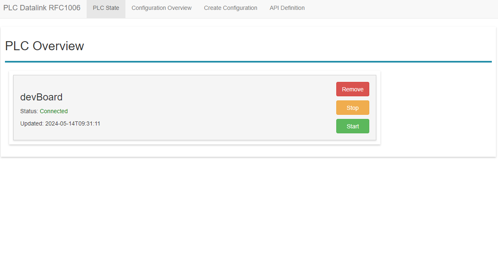
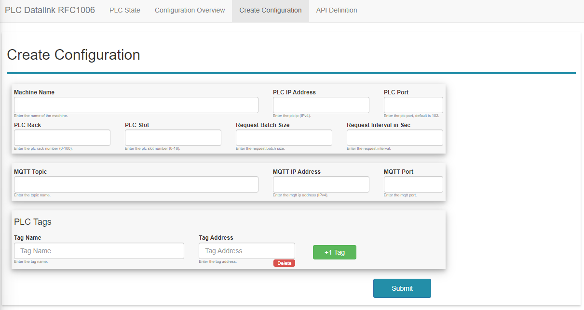
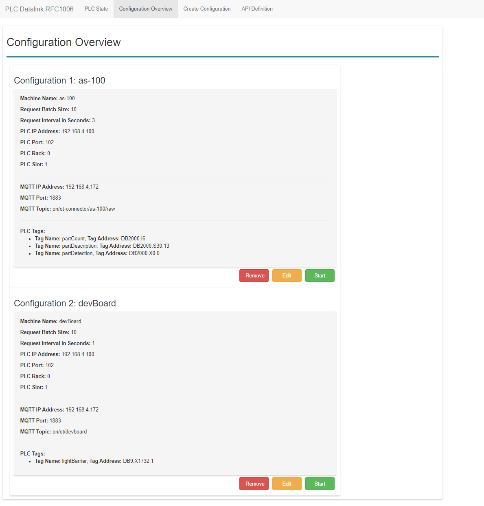
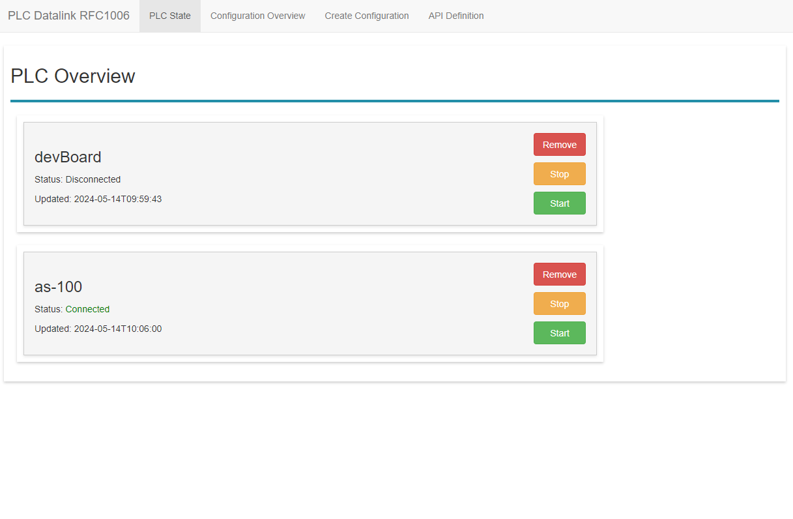
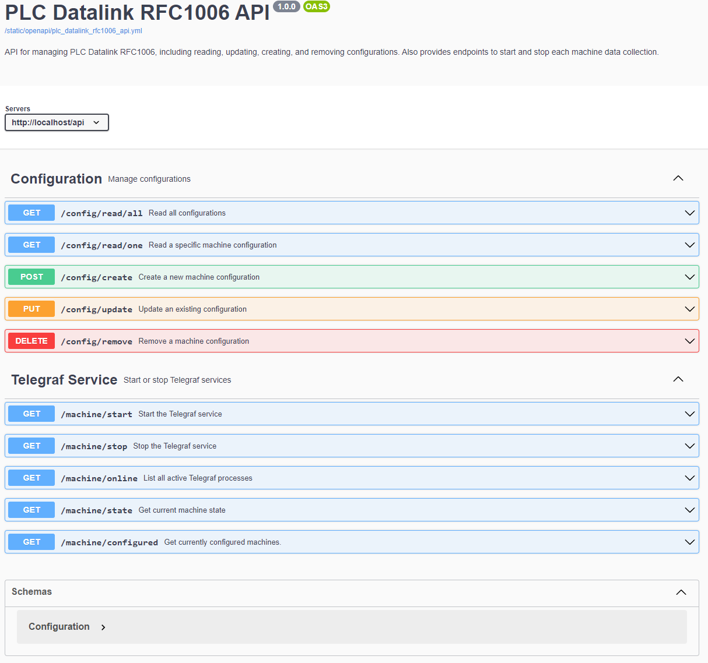

# Plc Datalink Rfc1006
Plc Datalink Rfc1006 is a software which is based on telegraf and is designed for industrial automation. The software enables seamless communication with PLCs using the RFC1006(S7) protocol. It reads specific data points, known as "Tags/DBs" from the PLC. After retrieving the data, the software pushes these values to an MQTT broker.


[](./LICENSE)

## Table of Contents
- [Get started](#get-started)
- [Usage](#usage)
- [Create Configuration](#create-configuration)
- [Configuration Overview](#configuration-overview)
- [PLC Overview](#plc-overview)
- [API Definition](#api-definition)
- [PLC Address specification](#plc-address-specification)
- [MQTT Output Example](#mqtt-output-example)
- [Contact](#Contact)


## Prerequisites
- Docker Compose
- MQTT Broker
- S7-PLC Addresses
- Chrome Browser

## Get started

### Building Docker Image
The build process for this project based GitHub Actions. The workflow involves the following steps:
- Building CouchDB on Linux Docker Engine
- Building Python Backend on Linux Docker Engine
- Building Angular Frontend on Linux Docker Engine
 
### Get and Run Docker Image

**Login to ACR**
```bash
az login
az acr login -n onconnecting
```

**Pull from ACR**
```bash
docker pull onconnecting.azurecr.io/plc-datalink-rfc1006-database:latest
docker pull onconnecting.azurecr.io/plc-datalink-rfc1006-backend:latest
docker pull onconnecting.azurecr.io/plc-datalink-rfc1006-frontend:latest
```
**Starting the Container localy**
To start with build the container localy, execute `dc-plc-datalink-rfc1006-local.yml` file. This Docker Compose configuration sets up three services, `plc-datalink-rfc1006-database`, `plc-datalink-rfc1006-backend` and `plc-datalink-rfc1006-frontend`, along with a network and a volume.
```bash
docker-compose -f dc-plc-datalink-rfc1006-local.yml up -d
```

**Starting the Container from ACR**
To start with build the container localy, execute `dc-plc-datalink-rfc1006-acr.yml` file. This Docker Compose configuration sets up three services, `plc-datalink-rfc1006-database`, `plc-datalink-rfc1006-backend` and `plc-datalink-rfc1006-frontend`, along with a network and a volume.
```bash
docker-compose -f dc-plc-datalink-rfc1006-acr.yml up -d
```

**Services:** 
- **plc-datalink-rfc1006-database:**
  - Image: `onconnecting.azurecr.io/plc-datalink-rfc1006-database:latest`
  - Container Name: `plc-datalink-rfc1006-database`
  - Hostname: `plc-datalink-rfc1006-database`
  - Volumes: Mounts a volume named `plc-datalink-rfc1006-database-data` to `/opt/couchdb/data`
  - Networks: Connected to the `plc-datalink-rfc1006-network`

- **plc-datalink-rfc1006-backend:**
  - Image: `onconnecting.azurecr.io/plc-datalink-rfc1006-backend:latest`
  - Container Name: `plc-datalink-rfc1006-backend`
  - Hostname: `plc-datalink-rfc1006-backend`
  - Dependencies: Depends on `plc-datalink-rfc1006-database`. 
  - Volumes: Mounts a volume named `plc-datalink-rfc1006-backend-data` to `/etc/telegraf`
  - Networks: Connected to the `plc-datalink-rfc1006-network`

- **plc-datalink-rfc1006-frontend:**
  - Image: `onconnecting.azurecr.io/plc-datalink-rfc1006-frontend:latest`
  - Container Name: `plc-datalink-rfc1006-frontend`
  - Hostname: `plc-datalink-rfc1006-frontend`
  - Ports: Exposes port `80` on the host and forwards it to port `80` on the container
  - Dependencies: Depends on `plc-datalink-rfc1006-backend`
  - Networks: Connected to the `plc-datalink-rfc1006-network`

**Networks:**
- **plc-datalink-rfc1006-network:**
  - Name: `plc-datalink-rfc1006-network`
  - Driver: `bridge`

**Volumes**
- **plc-datalink-rfc1006-backend-data:**
    name: `plc-datalink-rfc1006-backend-data`
- **plc-datalink-rfc1006-database-data:**
    name: `plc-datalink-rfc1006-database-data`

After executing docker-compose, database, frontend and backend containers should be up and running, ready for use.

## Usage
Once the docker images are running, the application will provide webbased ui for configuring the PLC Server and MQTT Broker with all necessary properties.

### Open the configuration UI
The UI is webbased and the access is over the localhost on port 80.
Example
```bash
http://localhost
```



## Create Configuration
This section allows users to configure the connection settings for communicating with a PLC over the RFC1006/S7 protocol. Each option is detailed below:

- `Machine anme`: Specify the machine name for the connection.
- `PLC IP Address`: Enter the IP address of the PLC. The input should follow the standard IPv4 format (e.g., 192.168.1.1).
- `PLC Port`: Enter the Port number of the PLC. The default port is 102.
- `Rack`: Select the rack number where the PLC is mounted.
- `Slot`: Choose the slot number that the CPU occupies in the rack.
- `Batch-request Size`: Specify the size for batching requests. Max count of fields to be bundled in one batch-request e.g., 10.
- `Request Interval` Define the interval at which the software will request data from the PLC. This interval is specified in seconds (1s).

In this section allows users to configure the connection settings for MQTT broker. Each option is detailed below:

- `MQTT Server`: Enter the IP address of the MQTT broker. The input should follow the standard IPv4 format (e.g., 192.168.1.1)
- `MQTT Port`: Specify the port number used for the MQTT connection. The default MQTT port is 1883 for unencrypted communication
- `MQTT Topic`: Enter the MQTT topic under which the messages should be published or from which they should be subscribed. Topics are structured in a hierarchy, e.g., on/ot-connector/devBoard/raw.

This section enables users to configure the address mappings for an PLC. Below is an explanation of each configurable option:

- `Tag Name`: Enter the tag name (e.g., part_counter) for identify the response value.
- `PLC Address`: Enter the PLC address (e.g., DB2000.I6). The address format should follow the pattern <area>.<type><address>[.extra] The address pattern is here specified [PLC Address specification](#plc-address-specification)
- `+1 Tag`: This button add dynamically new fields for entering additional address configurations. Clicking this button will generate a new set of input fields.
- `Delete`: This button remove the added new address field.

The button `Submit` create the machine configuration and persist it.



## Configuration Overview
This overview list all created and persisted configurations for each machine. With the buttons, it possible to manage the machine configuration.

- `Start`: This button allow to start the configuration and collect data from PLC. Initialize a new machine configuration can be take up to 20 seconds.
- `Edit`: This button allow to reconfigure the machine settings and update the configuration
- `Remove`: This button remove the existing configuration.



## PLC Overview
This overview list all machines that was started with the current state of data collection. With the buttons it possible to manage the machine states. each state have a timestamp where it was updated.

- `Start`: This button allow to start the machine, if the machine allreade `Connected`, its restart the data collection. Start a machine configuration can be take up to 20 seconds.
- `Stop`: This button allow to stop the machine data collection, after that the state change to `Disconnected`. Stop a machine configuration can be take up to 20 seconds.
- `Remove`: This button remove the machine fro the list. For this its necessary to stop the machine.



## API Definition
All configuration and commands can be created with API. The definition is accessable in browser over the `API Definition` tab.



## PLC Address specification
Below is a detailed explanation of how to define each type of address. The general format for defining an address is <area>.<type><address>[.extra], where:

- `area`: Specifies the PLC memory area (e.g., DB1 for Data Block 1).
- `type`: Indicates the data type.
- `address`: The address within the specified area.
- `extra`: An optional parameter required by certain types for additional specificity.

**Supported Types and Examples** 
- `X – Bit`
  - Description: Represents a single bit. Requires the bit number as an extra parameter.
  - Example:
    - Name: Bool_Value
    - Address: DB2000.X0.0 (Data Block 2000, Bit 0 of Byte 0)
- `B – Byte (8 bit)` 
  - Description: Represents a byte.
  - Example:
    - Name: Byte_value
    - Address: DB2000.B1 (Data Block 2000, Byte 1)
- `C – Character (8 bit)`
  - Description: Represents a single character.
  - Example:
    - Name: Char_Value
    - Address: DB2000.C2 (Data Block 2000, Character in Byte 2)
- `W – Word (16 bit)`
  - Description: Represents a word.
  - Example:
    - Name: Word_Value
    - Address: DB2000.W2 (Data Block 2000, Word starting at Byte 2)
- `DW – Double Word (32 bit)`
  - Description: Represents a double word.
  - Example:
    - Name: DWord_Value
    - Address: DB2000.DW2 (Data Block 2000, Double Word starting at Byte 2)
- `I – Integer (16 bit)`
  - Description: Represents a signed 16-bit integer.
  - Example:
    - Name: Int_Value
    - Address: DB2000.I2 (Data Block 2000, Integer starting at Byte 2)
- `DI – Double Integer (32 bit)`
  - Description: Represents a signed 32-bit integer.
  - Example:
    - ame: DInt_Value
    - Address: DB2000.DI2 (Data Block 2000, Double Integer starting at Byte 2)
- `R – Real (IEEE 754, 32 bit)`
  - Description: Represents a 32-bit floating-point number.
  - Example:
    - Name: Real_Value
    - Address: DB2000.R2 (Data Block 2000, Real Number starting at Byte 2)
- `DT – Date-Time`
  - Description: Represents a date-time value, always converted to a Unix timestamp with nanosecond precision.
  - Example:
    - Name: DateTime_Value
    - Address: DB2000.DT2 (Data Block 2000, Date-Time starting at Byte 2)
- `S – String`
  - Description: Represents a string. Requires the maximum length of the string as an extra parameter.
  - Example:
    - Name: String_Value
    - Address: DB2000.S30.13 (Data Block 2000, String starting at Byte 30, with a maximum length of 13 characters)

## MQTT Output Example
The JSON structure represents a message that collected or processed within this application. Here's a breakdown of the components:

- `fields`: This key holds an object that represents the data points collected or to be displayed.
- `lightBarrier`: Indicates a boolean data point with a value of 0 (which typically represents false in boolean logic).
- `name`: Specifies the type or category of the data being handled. Here, it's labeled as "s7comm", indicating that this data is related to S7 communication with a PLC.
- `tags`: Contains metadata tags providing additional context for the data point.
- `host`: Represents the unique identifier or hostname of the server from which the data is sourced.
- `machine`: Provides a human-readable identifier for the machine or device related to the data point, indicate the data's origin or relevance to a specific machine or value type.
- `timestamp`: The time at which the data was recorded or received, represented in milliseconds since the Unix epoch.

```JSON
{
    "fields": {
        "lightBarrier": true
    },
    "name": "s7comm",
    "tags": {
        "host": "PLC Datalink RFC1006",
        "machine": "devBoard_lightBarrier"
    },
    "timestamp": 1710844221000
}
```

# Contributing
Contributions are welcome! Please fork this repository and submit a pull request for any features, bug fixes, or improvements. Ensure your code follows the established guidelines and is well-documented.

# License
This project is licensed under the MIT License - see the [LICENSE](./LICENSE) file for details.

# Contact
 
[](mailto:otto.fitz@onconnecting.de) 
[](https://www.linkedin.com/in/ottofitz/)
